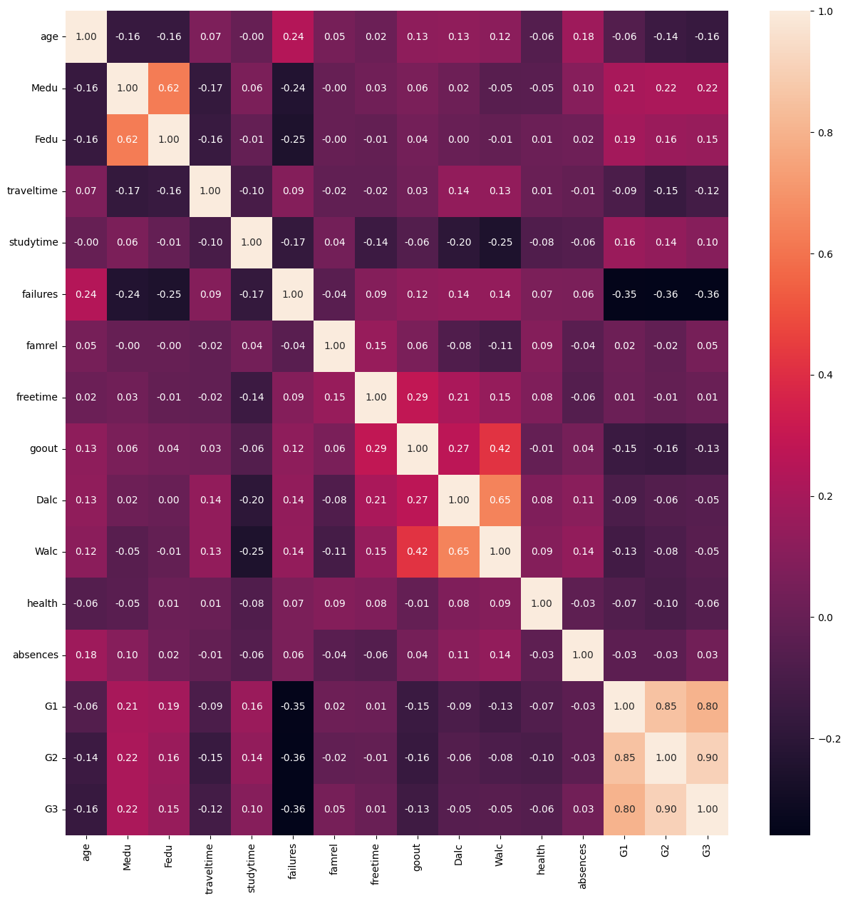

# Introduction

Ci-dessous, voici le guide et le code que nous avons exécuté sur Google Colab. Nous avons tous les deux un mac M1 donc nous n'avons pas pu entraîner notre modèle de données avec Notebook sur notre machine.

On a d'abord réalisé une heathmap sur notre dataset pour connaître les données qui étaient cohérentes.

Notre projet détermine le risque d'échec scolaire en fonction de différents critères à renseigner sur le front (age, nombre de sorties par semaine, consommation d'alcool, etc.)



Le code pour générer la heathmap :

```
pip3 install pandas
pip3 install numpy
pip3 install seaborn
pip3 install matplotlib

import numpy as np
import pandas as pd
import seaborn as sns
import matplotlib.pyplot as plt

from subprocess import check_output
print(check_output(["ls", "./input"]).decode("utf8"))

data = pd.read_csv('./sample_data/student.csv')
data.columns

plt.figure(figsize=(15,15))
sns.heatmap(data.corr(),annot = True,fmt = ".2f",cbar = True)
plt.xticks(rotation=90)
plt.yticks(rotation = 0)
```

# Utiles

- Le dataset se trouve dans files/student.csv
- Le modèle entrainé se trouve dans files/model.pkl

# Modèle de données

Le code de l'entraînement du modèle de données se trouve dans files/training.ipynb

# Body

Les informations à renseigner dans le body de la requête /predict sont :

```
{
	"age": 18,
	"traveltime": 1,
	"freetime": 1,
	"health": 1,
	"absences": 1,
	"Walc": 1,
	"Dalc": 1,
	"goout": 1
}
```

Les indices vont de 1 à 5 pour toutes les données sauf age qui varie entre 17 et 22 et absences qui varie entre 0 à 90.
